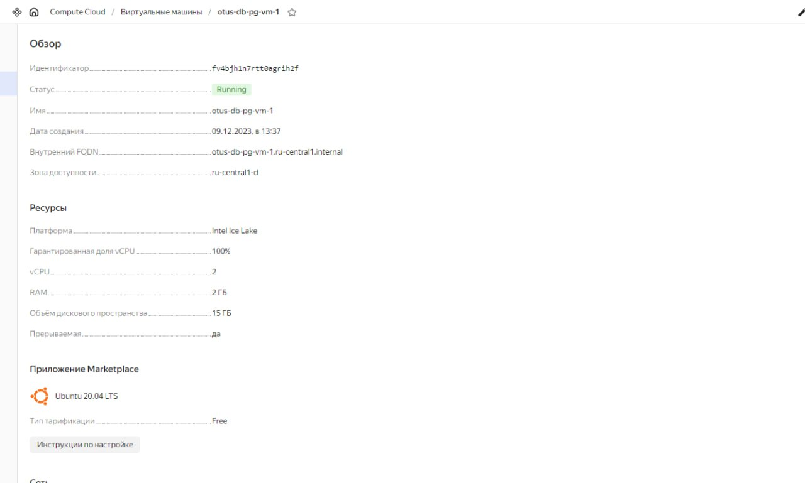
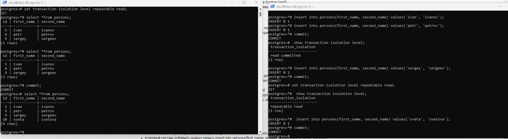

1. **_Создана ВМ в облаке Яндекс_**

1. **_Установлен Postgres 16_**
    * sudo apt update && sudo apt upgrade -y -q && sudo sh -c 'echo "deb http://apt.postgresql.org/pub/repos/apt $(lsb_release -cs)-pgdg main" > /etc/apt/sources.list.d/pgdg.list' && wget --quiet -O - https://www.postgresql.org/media/keys/ACCC4CF8.asc | sudo apt-key add - && sudo apt-get update && sudo apt -y install postgresql-16

1. **_Запуск psql из под пользователя postgres_**
    * sudo -u postgres psql
1. **_Выключение auto commit_**
    * \set AUTOCOMMIT OFF
1. **_Посмотреть текущий уровень изоляции show transaction isolation level_**
    * read committed
1. **_Чтобы начать транзакцию, с текущим уровнем изоляции, надо выполнить_**
    * begin;
1. > Начать новую транзакцию в обоих сессиях с дефолтным (не меняя) уровнем изоляции, в первой сессии добавить новую запись insert into persons(first_name, second_name) values('sergey', 'sergeev'); сделать select * from persons во второй сессии. > видите ли вы новую запись и если да то почему?
    * Т.к. AUTOCOMMIT отключен эта транзакция считается не завершённой, ввиду того что мы работаем в уровне изоляции read committed - данный уровень обеспечивает защиту от грязного чтения.
1. > завершить первую транзакцию - commit; сделать select * from persons во второй сессии видите ли вы новую запись и если да то почему?
    * Новая запись появилась т.к. транзакция была завершена (commit). Read committed позволяет видеть результаты завершенных транзакций
1. **_Начать новые транзакции в repeatable read_**
    * begin;
    * set transaction isolation level repeatable read;
    * или
    * begin transaction isolation level repeatable read;
1. > В первой сессии добавить новую запись insert into persons(first_name, second_name) values('sveta', 'svetova'); сделать select * from persons во второй сессии. видите ли вы новую запись и если да то почему?
    * Новой записи не видно.
1. > Завершить первую транзакцию - commit; сделать select * from persons во второй сессии. видите ли вы новую запись и если да то почему?
    * Новой записи не видно.
1. > Завершить вторую транзакцию. сделать select * from persons во второй сессии. видите ли вы новую запись и если да то почему?
    * Новая запись стала видна, т.к. текущий уровень изоляции транзакций repeatable read видит только те данные,
      которые были зафиксированы ДО начала текущей транзакции и не видит незафиксированные данные и изменения, произведённые другими транзакциями в процессе выполнения данной транзакции (до ее фиксации).
   